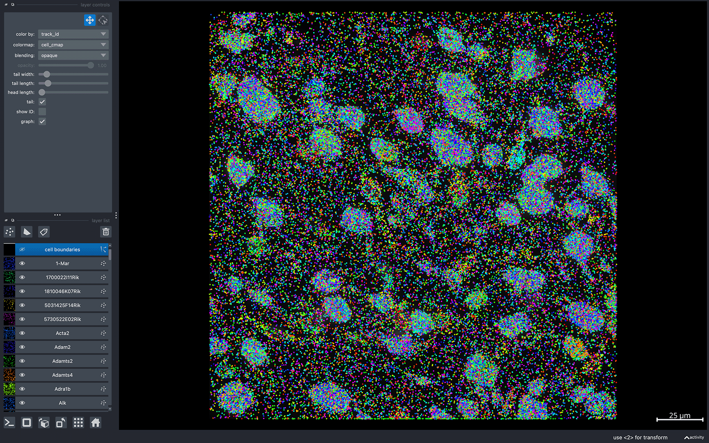
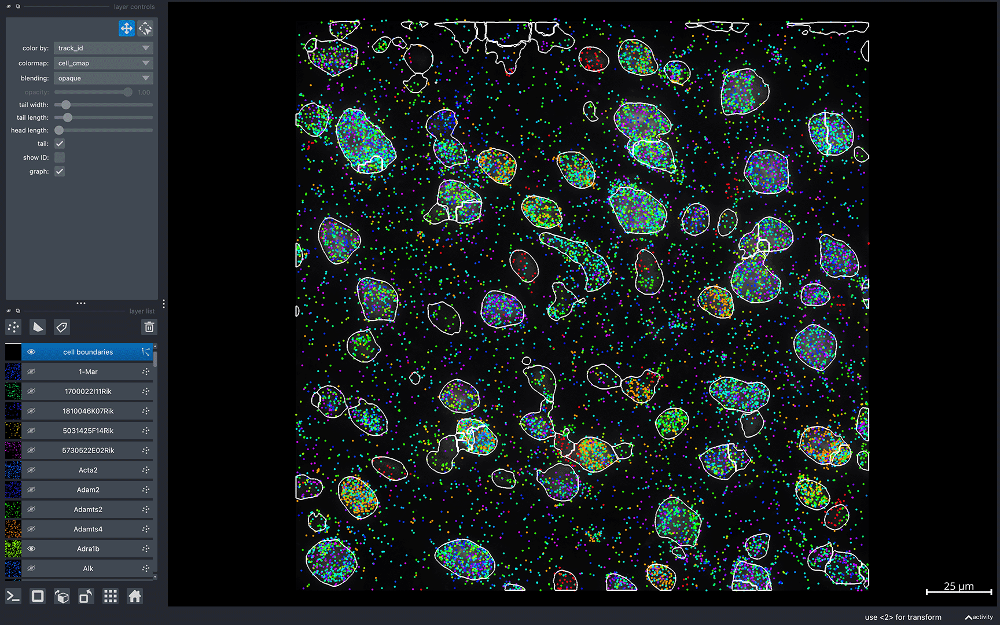

MERFISH - MERlin
================

This tutorial is for visualizing datasets from custom (home-built) MERFISH setups processed via the [MERlin](https://github.com/emanuega/MERlin) pipeline. Our aim was to make the Bella Vista package as lightweight as possible and make it easy for users to customize the code for custom setups, analyses, and needs. Check out the [napari website](https://napari.org/) for further documentation and features you can implement!

## MERlin pipeline outputs

Standard MERlin outputs folder organization:
```{eval-rst}
.. code-block:: 

  %ANALYSIS_HOME%
  ├── ...
  ├── ExportBarcodes
  │   └── barcodes.csv
  ├── ...
  ├── FiducialCorrelationWarp
  │   └── images
  │       └── aligned_images0.tif
          └── ...
          └── aligned_images406.tif
  ├── ...
  ├── RefineCellDatabases
  │   └── features
  │       └── feature_data_0.hdf5
          └── ...
          └── feature_data_406.tif
  ├── ...
  ├── codebook.csv
  ├── microscope_parameters.json
  └── positions.csv
```

From these outputs, it is possible to visualize tissue images, spatial transcript locations, and cell/nuclear segmentation boundaries.

To visualize tissue images, individual field-of-views (FOVs) must be stitched together. FOV images can be found in `FiducialCorrelationWarp/Images` in the MERlin output folder. Currently, Bella Vista does not include a stitching pipeline. Stitching can be accomplished using image processing utilizing python packages such as [NumPy](https://numpy.org/) and [Dask](https://www.dask.org/) or softwares such as [BigStitcher](https://imagej.net/plugins/bigstitcher/). The output stitched image must be a TIFF image, with individually stitched images for each channel you wish to visualize. The stitched images should be saved in the `%ANALYSIS_HOME%` directory.

Transcript locations and cell/nuclear segmentations exported by MERlin can be processed directly by Bella Vista.

In order to visualize your MERFISH dataset in Bella Vista, you will need to create a dataset-specific JSON configuration file containing paths to the MERlin outputs for your dataset. These output files will be processed to generate visualization files for Bella Vista. Creating these visualization files will take a few minutes but only need to be created once. For subsequent runs, `create_inputs` can be set to `False`.

## Configuration JSON file structure

```{eval-rst}
.. code-block:: JSON

    { 
        "system": "merlin", 
        "data_folder": "/path/to/merlin_outs",
        "create_bellavista_inputs": true,

        "visualization_parameters": {
            "plot_image": true,
            "plot_transcripts": true,
            "plot_allgenes": true,
            "genes_visible_on_startup": false,
            "plot_cell_seg": true
        },

        "input_files": {
                "transcript_filename": "ExportBarcodes/barcodes.csv",
                "codebook": "codebook.csv",
                "images": "DAPI_z3.tif",
                "microscope_parameters": "microscope_parameters.json",
                "positions_list": "positions.csv",
                "z_plane": 3,
                "cell_segmentation": "RefineCellDatabases/features"
        }
    }
```

## Input file parameters (MERlin)

**transcript_filename**: *string*
: relative path to CSV file containing decoded gene transcript spatial coordinates. If None, no transcripts will be processed

**codebook**: *string*
: relative path to CSV containing map from `barcode_id` to gene ID. This is *required* to plot transcripts. If None, no transcripts will be processed

**images**: *string or 1D array of strings, default=None*
: relative path to stitched image file(s). Must be a TIFF file. If None, no images will be processed
  > When visualizing a single image, provide the file path as a string. For multiple images, pass them as a list of filenames. For example, use "DAPI.tif" for a single image or ["DAPI.tif", "PolyT.tif"] for multiple images

**microscope_parameters**: *string*
: relative path to JSON file containing microscope micron to pixel transform. This is *required* if displaying images. If None, no images will be processed

**positions_list**: *string*
: relative path to CSV file containing micron microscope positions for each FOV. This is *required* if displaying images. If None, no images will be processed

**z_plane**: *integer, default=0*
: z-plane of segmentations to plot. We suggest this match the z-plane of the image you are visualizing. If None, the segmentations from the first z-plane will be processed

**cell_segmentation**: *string, default=None*
: relative path to folder containing HDF5 cell segmentation boundaries. If None, no cell segmentations will be processed

**nuclear_segmentation**: *string, default=None*
: relative path to folder containing HDF5 nuclear segmentation boundaries. If None, no nuclear segmentations will be processed

```{eval-rst}
.. important::

  All input file paths **must** be relative paths to :samp:`data_folder`

```
```{eval-rst}
.. note::
  If you are missing some input files, remove those input file parameters from the JSON file. Bella Vista will skip the preparation of visualization files for these data.

  For example, if you do not have cell segmentations, the input file parameters in your JSON file might look like this: 

  .. code-block:: JSON

        "input_files": {
            "transcript_filename": "barcodes.csv",
            "codebook": "codebook.csv",
            "images": "DAPI.tif",
            "microscope_parameters": "microscope_parameters.json",
            "positions_list": "positions.csv"
        }
```
## General parameters

**system**: *string*
: Value: `"merlin"`\
 The input is not case-sensitive, so values "merlin", "MERlin", and "MERLIN" are treated equivalently

**data_folder**: *string*
: The path to the folder where the dataset output files are stored. Bella Vista visualization files will be saved in a new folder named `BellaVista_output` within the data_folder.
  
**create_bellavista_inputs**: *boolean, default=true*
: Specifies whether to generate the necessary visualization files for Bella Vista. It should be set to `true` when loading the data for the first time. It can be set to `false` in later runs, as the files will already have been created.

  > If set to `true` and the visualization files already exist from a previous run, Bella Vista will skip recreating those files and only generate any missing ones.


## Visualization parameters

**plot_image**: *boolean, default=false*
: Display image(s)

**plot_transcripts**: *boolean, default=false*
: Plot spatial coordinates of gene transcripts

**plot_allgenes**: *boolean, default=true*
: Plot transcripts for all gene IDs. If set to `false`, only the gene IDs specified in `selected_genes` will be plotted

**genes_visible_on_startup**: *boolean, default=false*
: Controls the visibility of all gene layers at startup. If set to `false`, the gene layers will be hidden
> Setting this option to false improves navigation performance. Gene layers can be shown later using the toggle visibility feature.

**selected_genes**: *1D array of strings, default=None*
:  Specifies the gene IDs whose transcripts will be plotted. If None, transcripts for all genes will be plotted

**plot_cell_seg**: *boolean, default=false*
: Plot cell segmentation

**plot_nuclear_seg**: *boolean, default=false*
: Plot nuclear segmentation

**transcript_point_size**: *float, default=1*
: Size of the points representing individual transcript coordinates

**contrast_limits**: *tuple array of integers, default=None*
: Range of values [0, 65535] used to set the contrast limits for the displayed image(s)

**rotate_angle**: *integer, default=0*
: Rotation angle in degrees, within the range [0, 360], by which to rotate the data

## Loading Bella Vista

Once your JSON is correctly configured for your dataset, you can run Bella Vista in the terminal:

  - Replace `my_dataset.json` with the filename of the JSON you created. The JSON file argument should contain the file path to your JSON file.
```{eval-rst}
.. code-block:: python

  bellavista my_dataset.json
```
```{eval-rst}
.. note::

    It will take a few minutes to create the required data files. The terminal will print updates & have progress bars for time consuming steps.
```

Once loaded, you should see a napari window displaying your data. Now, you can interactively move around the napari canvas to explore the data. Try zooming in & out, toggling layers on & off to see different spatial patterns! 

```{eval-rst}
.. tip::

    To visualize a single layer, and hide all other layers, :samp:`Option/Alt-click` on the visibility button (the eye, to the left of the layer name). Check out :ref:`helpful-napari-tips` in the FAQ for more tips!
```

Refer to the tutorial below for a step-by-step guide on running Bella Vista with a sample dataset and JSON.

If you encounter any issues, please check the [FAQ](../faq.md#frequently-asked-questions). If you're experiencing issues not addressed in the FAQ, please check the open issues or [open a new issue](https://github.com/pkosurilab/BellaVista/issues)in our GitHub repository. You can also leave any feedback here!

<br>

## Getting Started (with sample data)

### Download sample data

For this example, we processed the first FOV from a MERFISH sample dataset from the Brain Image Library [@Zhuang2020] via MERlin.

1. Download MERlin processed MERFISH mouse primary motor cortex dataset (mouse 2, sample 4, FOV 0) from [dropbox](https://www.dropbox.com/scl/fo/8km4m5wcj5a95ezfqyz7o/AOonVJDDv9GdzwdD-4_7NcU?rlkey=hcruoy48tzveyewkw1z2fya5t).

### Load Bella Vista

2. In the folder downloaded from dropbox, open `merlin_sample.json`
3. Replace the path in `data_folder`
      - Python cannot parse JSON files containing file paths with single backslashes (\\). To avoid errors, use either forward slashes (/) or double backslashes (\\\\) when representing file paths in the JSON strings.

**merlin_sample.json**
```{eval-rst}
.. code-block:: JSON 
  :emphasize-lines: 3-4

  { 
      "system": "merlin", 
      "data_folder": "/path/to/merlin_outs",
      "create_bellavista_inputs": true,

      "parameters": { 
          "plot_image": true,
          "plot_transcripts": true,
          "plot_allgenes": true,
          "genes_visible_on_startup": true,
          "plot_cell_seg": true,
          "transcript_point_size": 0.75
      },

      "input_files": {
          "transcript_filename": "ExportBarcodes/barcodes.csv",
          "codebook": "codebook.csv",
          "images": "polyT_z3.tif",
          "microscope_parameters": "microscope_parameters.json",
          "positions_list": "positions.csv",
          "z_plane": 3,
          "cell_segmentation": "RefineCellDatabases/features"
      }
  }
```

4. In the terminal, run Bella Vista with the MERlin sample JSON:
    - The JSON file argument should contain the file path to the JSON file.

```{eval-rst}
.. code-block:: python

  bellavista merlin_sample.json
```

```{eval-rst}
.. note::

    It will take a few minutes to create the required data files. The terminal will print updates & have progress bars for time consuming steps.
```

Using this JSON file, the displayed output should look similar to this: 



```{eval-rst}
.. note::

    Gene colors are assigned randomly every time Bella Vista is launched. So, the gene colors displayed in your window will be different from the image above. See :ref:`useful-napari-commands` in the FAQ for commands to configure gene colors and other customizable visualization options. 
    
    To reproduce the same colors every time you launch Bella Vista, see :ref:`creating-figures` in the Figure Guide.
```

Try zooming in & out, toggling gene and cell segmentation layers on & off:



```{eval-rst}
.. tip::

    To visualize a single layer, and hide all other layers, :samp:`Option/Alt-click` on the visibility button (the eye, to the left of the layer name). Check out :ref:`helpful-napari-tips` in the FAQ for more tips!
```

If you encounter any issues, please check the [FAQ](../faq.md#frequently-asked-questions). If you're experiencing issues not addressed in the FAQ, please check the open issues or [open a new issue](https://github.com/pkosurilab/BellaVista/issues)in our GitHub repository. You can also leave any feedback here!

### References

[@Zhuang2020]: Zhuang, Xiaowei, Zhang, Meng. (2020). A molecularly defined and spatially resolved cell atlas of the mouse primary motor cortex. [ Collection / Dataset ]. Brain Image Library. https://doi.org/10.35077/g.21

<div class="flex justify-between items-center pt-6 mt-12 border-t border-border gap-4">
    <div class="mr-auto">
      <a href="../tutorials.html" class="inline-flex items-center justify-center rounded-md text-sm font-medium transition-colors border border-input hover:bg-accent hover:text-accent-foreground py-2 px-4" style="text-decoration: none;">
        <svg xmlns="http://www.w3.org/2000/svg" width="24" height="24" viewBox="0 0 24 24" fill="none" stroke="currentColor" stroke-width="2" stroke-linecap="round" stroke-linejoin="round" class="mr-2 h-4 w-4">
          <polyline points="15 18 9 12 15 6"></polyline>
        </svg>
        Tutorials
      </a>
    </div>
  <div class="ml-auto">
    <a href="../figure_guide.html" class="inline-flex items-center justify-center rounded-md text-sm font-medium transition-colors border border-input hover:bg-accent hover:text-accent-foreground py-2 px-4" style="text-decoration: none;">
      Figure Guide
      <svg xmlns="http://www.w3.org/2000/svg" width="24" height="24" viewBox="0 0 24 24" fill="none" stroke="currentColor" stroke-width="2" stroke-linecap="round" stroke-linejoin="round" class="ml-2 h-4 w-4">
        <polyline points="9 18 15 12 9 6"></polyline>
      </svg>
    </a>
  </div>
</div>