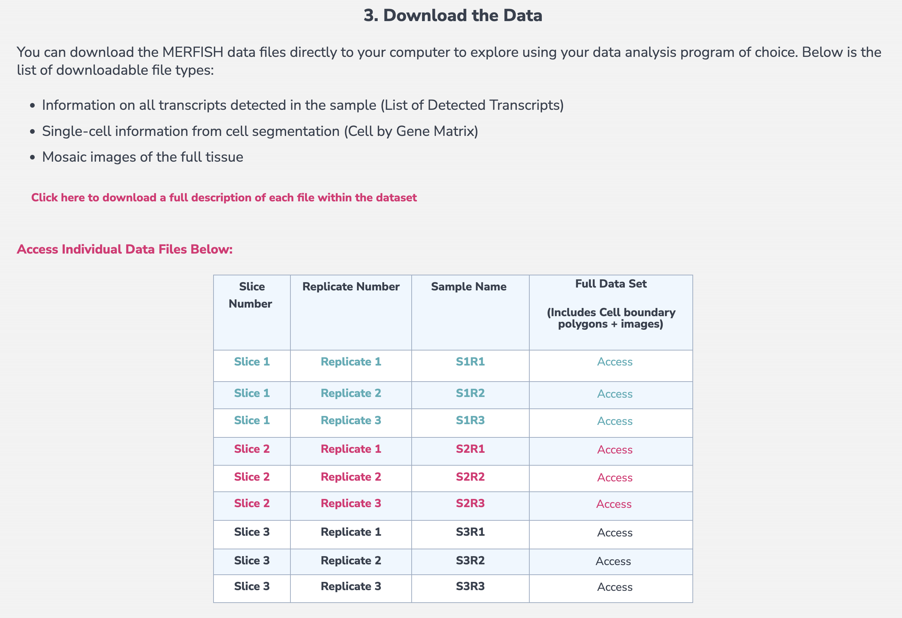
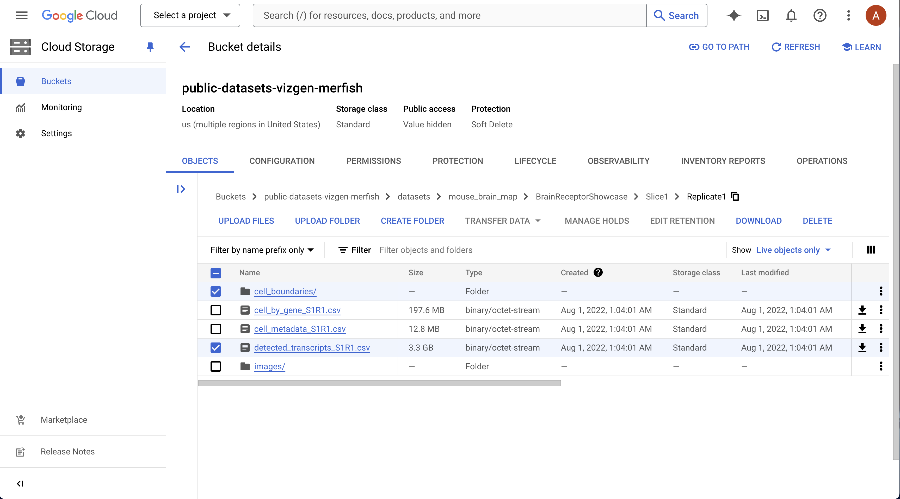

Vizgen MERSCOPE
===============

This tutorial is for visualizing Vizgen MERSCOPE datasets. 

In order to visualize your MERSCOPE dataset in Bella Vista, you will need to create a dataset-specific JSON configuration file containing paths to the MERSCOPE outputs for your dataset. These output files will be processed to generate visualization files for Bella Vista. Creating these visualization files will take a few minutes but only need to be created once. For subsequent runs, `create_inputs` can be set to `False`.

## Configuration JSON file structure

```{eval-rst}
.. code-block:: JSON

    { 
        "system": "MERSCOPE", 
        "data_folder": "/path/to/MERSCOPE_dataset_outs",
        "bella_vista_output_folder": "/path/to/MERSCOPE_dataset_outs/bellavista_outs",
        "create_bellavista_inputs": true,

        "visualization_parameters": {
            "plot_image": true,
            "plot_transcripts": true,
            "plot_allgenes": true,
            "genes_visible_on_startup": false,
            "plot_cell_seg": true
        },

        "input_files": {
            "transcript_filename": "detected_transcripts.csv",
            "um_to_px_transform": "micron_to_mosaic_pixel_transform.csv",
            "images":  "mosaic_DAPI_z0.tif",
            "z_plane": 0,
            "cell_segmentation": "cell_boundaries"
        }
    }
```

## Input file parameters (MERSCOPE)


**transcript_filename**: *string*
: relative path to CSV file containing transcript spatial locations. If None, no transcripts will be processed

**images**: *string or 1D array of strings*
: relative path to image file(s). Must be a TIFF file. If None, no images will be processed
> When visualizing a single image, provide the file path as a string. For multiple images, pass them as a list of filenames. For example, use "DAPI.tif" for a single image or ["DAPI.tif", "PolyT.tif"] for multiple images

**um_to_px_transform** *string*
: relative path to CSV file containing micron to pixel transformations. This is *required* if displaying images. If None, no images will be processed

**z_plane**: *integer, default=0*
: z-plane of segmentations to plot. We suggest this match the z-plane of the image you are visualizing. If None, the segmentations from the first z-plane will be processed

**cell_segmentation**: *string*
: relative path to cell segmentations. This must be a Parquet file (MERSCOPE v232 or later) or a folder containing HDF5 files (pre v232). If None, no cell segmentations will be processed

**nuclear_segmentation**: *string*
: relative path to nuclear segmentations. This must be a Parquet file (MERSCOPE v232 or later) or a folder containing HDF5 files (pre v232). If None, no nuclear segmentations will be processed


```{eval-rst}
.. important::

  All input file paths **must** be relative paths to :samp:`data_folder`

```

```{eval-rst}
.. note::
  If you are missing some input files, remove those input file parameters from the JSON file. Bella Vista will skip the visualization of these data.

  For example, if you do not have cell segmentations, the input file parameters in your JSON file might look like this: 

  .. code-block:: JSON

      "input_files": {
        "transcript_filename": "detected_transcripts.csv",
        "images":  "mosaic_DAPI_z0.tif",
        "um_to_px_transform": "micron_to_mosaic_pixel_transform.csv"
      }
```

## General parameters

**system**: *string*
: Value: `"MERSCOPE"`\
 The input is not case-sensitive, so values "merscope", "Merscope", and "MERSCOPE" are treated equivalently

**data_folder**: *string*
: Path to folder containing dataset output files
  
**bella_vista_output_folder**: *string*
: Path to save & load Bella Vista visualization files
  
**create_bellavista_inputs**: *boolean, default=true*
: Create required visualization files for Bella Vista. Must be `true` when first loading data.\
 Can be `false` in subsequent runs (since files have already been created)
 > If set to `true` and the visualization files have already been created from a previous run, Bella Vista will skip the preparation of existing visualization files and only create files that do not exist.

## Visualization parameters

**plot_image**: *boolean, default=false*
: Display image(s)

**plot_transcripts**: *boolean, default=false*
: Plot gene transcript spatial coordinates

**plot_allgenes**: *boolean, default=true*
: Plot transcripts for all gene IDs. If false, only gene IDs in `selected_genes` will be plotted

**genes_visible_on_startup**: *boolean, default=false*
: Controls the visibility of all gene layers at startup. If set to false, the gene layers will be hidden
> Setting this option to false improves navigation performance. Gene layers can be shown later using the toggle visibility feature.

**selected_genes**: *1D array of strings, default=None*
: Only plot transcripts for gene IDs specified in list. If None, all genes will be plotted by default

**plot_cell_seg**: *boolean, default=false*
: Plot cell segmentation

**plot_nuclear_seg**: *boolean, default=false*
: Plot nuclear segmentation

**transcript_point_size**: *float, default=1.0*
: Point size for individual transcript coordinates

**contrast_limits**: *tuple array of integers, default=None*
: Values in the range [0, 65535]. Contrast limits for displayed image(s)

**rotate_angle**: *integer, default=0*
: Value in the range [0, 360]. Angle in degrees by which to rotate the data

## Loading Bella Vista

Once your JSON is correctly configured for your dataset, you can run Bella Vista in the terminal:

  - Replace `my_dataset.json` with the filename of the JSON you created. The JSON file argument should contain the file path to your JSON file.
```{eval-rst}
.. code-block:: python

  bellavista my_dataset.json
```
```{eval-rst}
.. note::

    It will take a few minutes to create the required data files. The terminal will print updates & have progress bars for time consuming steps.
```

Once loaded, you should see a napari window displaying your data. Now, you can interactively move around the napari canvas to explore the data. Try zooming in & out, toggling layers on & off to see different spatial patterns! 

```{eval-rst}
.. tip::

    To visualize a single layer, and hide all other layers, :samp:`Option/Alt-click` on the visibility button (the eye, to the left of the layer name). Check out :ref:`helpful-napari-tips` in the FAQ for more tips!
```

Refer to the tutorial below for a step-by-step guide on running Bella Vista with a sample dataset and JSON.

If you encounter any issues, please check the [FAQ](../faq.md#frequently-asked-questions). If you're experiencing issues not addressed in the FAQ, please check the open issues or [open a new issue](https://github.com/pkosurilab/BellaVista/issues)in our GitHub repository. You can also leave any feedback here!

<br>

## Getting Started (with sample data)

### Download sample data

Download sample data: MERSCOPE mouse brain dataset (slice 1, replicate 1)
[https://info.vizgen.com/mouse-brain-map](https://info.vizgen.com/mouse-brain-map)

To download the dataset, Vizgen may ask you to fill out a questionnaire.

<p align="center">
  <picture>
    
  </picture>
</p>
<p align="center">

For this example, you only need to download:
- `detected_transcripts_S1R1.csv`
- `cell_boundaries/`
- `mosaic_DAPI_z3.tif` & `micron_to_mosaic_pixel_transform.csv` found inside `images/`

<p align="center">
  <picture>
    
  </picture>
</p>
<p align="center">

```{eval-rst}
.. note::

  To download the :samp:`cell_boundaries` folder, you may need to use gsutil (Google Cloud Console will prompt you if this is the case).

  Here is some information on how to use gsutil: https://cloud.google.com/storage/docs/gsutil_install

```

 <!-- FINISH NOTES ABOUT GSUTIL INFO -->


For this example, we will visualize a subset of the genes which are listed in the visualization parameter `selected_genes` to speed up computation. If you wish to visualize all genes, set the visualization parameter `plot_allgenes` to `true`. If visualizing all genes, we recommend setting `genes_visible_on_startup` to `false` to improve navigation performance.

### Load Bella Vista

1. Download the sample JSON file from the GitHub repository: [BellaVista/sample_json/merscope_sample.json](https://github.com/pkosurilab/BellaVista/tree/main/sample_json/merscope_sample.json)
2. Replace the paths in the `data_folder` and `bella_vista_output_folder` properties
<br><br>

**merscope_sample.json**
```{eval-rst}
.. code-block:: JSON
  :emphasize-lines: 3-4

  { 
      "system": "merscope", 
      "data_folder": "/path/to/vizgen_brain_s1r1",
      "bella_vista_output_folder": "/path/to/vizgen_brain_s1r1/bellavista_outs",
      "create_bellavista_inputs": true,

      "visualization_parameters": { 
          "plot_image": true,
          "plot_transcripts": true,
          "plot_allgenes": false,
          "genes_visible_on_startup": true,
          "selected_genes": ["Fgfr2","Tmem108","Glp2r","Slc47a1","Tacr1","Th",
                              "Ntsr1","Sstr3","S1pr3","Sstr1","Ptgfr","Qrfpr",
                              "Gpr101","Drd5","Chat"],
          "plot_cell_seg": true,
          "transcript_point_size": 0.75,
          "contrast_limits": [0, 26000]
      },
      
      "input_files": {
          "transcript_filename": "detected_transcripts_S1R1.csv",
          "images":  "mosaic_DAPI_z3.tif",
          "um_to_px_transform": "micron_to_mosaic_pixel_transform.csv",
          "z_plane": 3,
          "cell_segmentation": "cell_boundaries"
      }
  }
```

3. In the terminal, run Bella Vista with the MERSCOPE sample JSON:
    - The JSON file argument should contain the file path to the JSON file.
```{eval-rst}
.. code-block:: python

  bellavista merscope_sample.json
```

```{eval-rst}
.. note::

    It will take a few minutes to create the required data files. The terminal will print updates & have progress bars for time consuming steps.
```

Using this JSON file, the displayed output should look similar to this:


Now, you can interactively move around the napari canvas to explore the data. Try zooming in & out, toggling layers on & off to see different spatial patterns!

```{eval-rst}
.. tip::

    To visualize a single layer, and hide all other layers, :samp:`Option/Alt-click` on the visibility button (the eye, to the left of the layer name). Check out :ref:`helpful-napari-tips` in the FAQ for more tips!
```

```{eval-rst}
.. note::

    Gene colors are assigned randomly every time Bella Vista is launched. So, the gene colors displayed in your window will be different from the image above. See :ref:`helpful-napari-tips` in the FAQ for commands to configure gene colors and other customizable visualization options. 
    
    To reproduce the same colors every time you launch Bella Vista, see :ref:`creating-figures` in the figure guide.
```

If you encounter any issues, please check the [FAQ](../faq.md#frequently-asked-questions). If you're experiencing issues not addressed in the FAQ, please check the open issues or [open a new issue](https://github.com/pkosurilab/BellaVista/issues)in our GitHub repository. You can also leave any feedback here!


<div class="flex justify-between items-center pt-6 mt-12 border-t border-border gap-4">
    <div class="mr-auto">
      <a href="../tutorials.html" class="inline-flex items-center justify-center rounded-md text-sm font-medium transition-colors border border-input hover:bg-accent hover:text-accent-foreground py-2 px-4" style="text-decoration: none;">
        <svg xmlns="http://www.w3.org/2000/svg" width="24" height="24" viewBox="0 0 24 24" fill="none" stroke="currentColor" stroke-width="2" stroke-linecap="round" stroke-linejoin="round" class="mr-2 h-4 w-4">
          <polyline points="15 18 9 12 15 6"></polyline>
        </svg>
        Tutorials
      </a>
    </div>
  <div class="ml-auto">
    <a href="../figure_guide.html" class="inline-flex items-center justify-center rounded-md text-sm font-medium transition-colors border border-input hover:bg-accent hover:text-accent-foreground py-2 px-4" style="text-decoration: none;">
      Figure Guide
      <svg xmlns="http://www.w3.org/2000/svg" width="24" height="24" viewBox="0 0 24 24" fill="none" stroke="currentColor" stroke-width="2" stroke-linecap="round" stroke-linejoin="round" class="ml-2 h-4 w-4">
        <polyline points="9 18 15 12 9 6"></polyline>
      </svg>
    </a>
  </div>
</div>