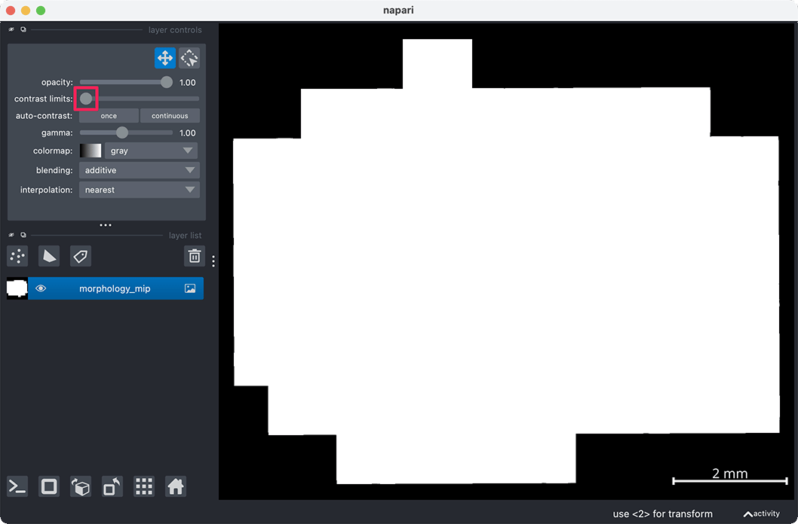
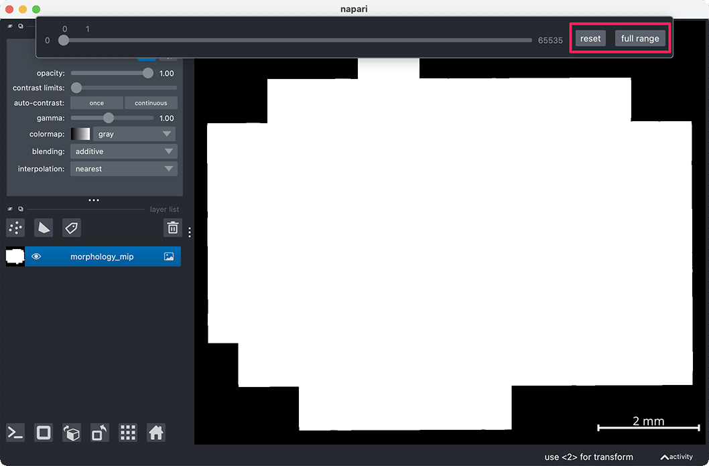
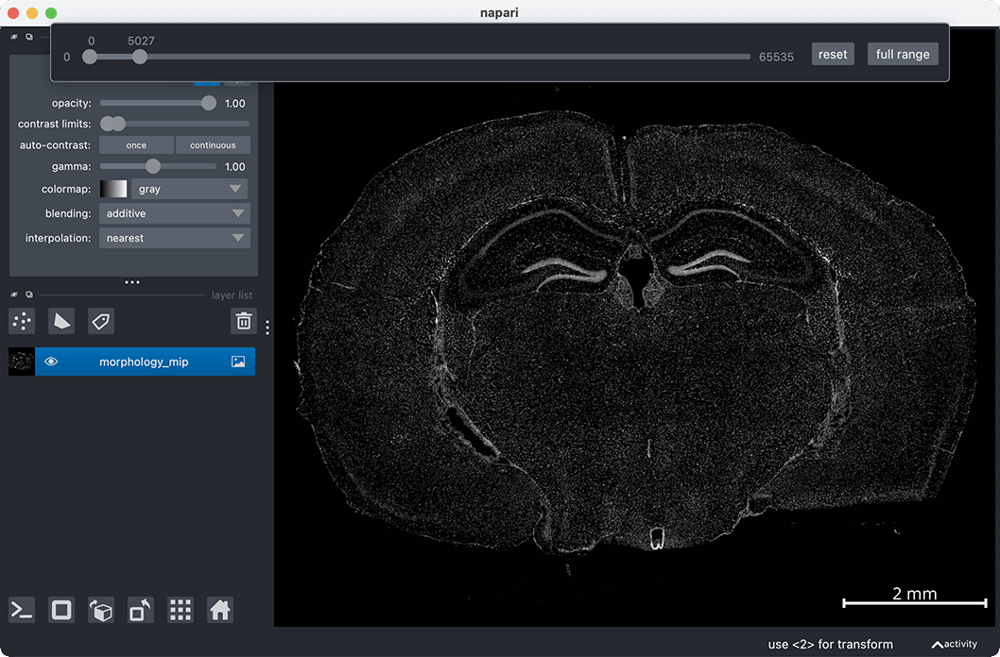

```{toctree}
:hidden: true
```
# {octicon}`question` FAQ

Here, you will find some helpful napari tips and answers to frequently asked questions. If you have suggestions for additional commands that others might find helpful or if you're encountering issues not covered in the FAQ, please check the open issues or [open a new issue](https://github.com/pkosurilab/BellaVista/issues) in the GitHub repository.

(helpful-napari-tips)=
##  {octicon}`light-bulb` Helpful napari tips

This is a collection of helpful tips we've compiled based on user feedback. We will continue to update this list regularly.

Refer to the napari website for more documentation: [napari.org](https://napari.org)

### Managing Layer Visibility

{octicon}`light-bulb` 
To visualize a single layer, and hide all other layers, `Option/Alt-click` on the visibility button (the eye, to the left of the layer name). To show all layers again `Option/Alt-click` on the visibility button a second time.  

{octicon}`light-bulb` 
To change the visibility of many layers at once, click on the first layer you want to select. Hold down the Shift key and click on the last layer in the range. This will select all layers between the two. Once your layers are selected, `Right-click` on any of the selected layers to bring up bring up a menu with visibility options. From the menu, select the appropriate visibility option and this will be applied to all selected layers.

### Managing Point Layers

{octicon}`light-bulb`
To change the color for a point layer (representing a gene), select all points in the layer using the `A` hotkey while in select mode. Once the points are selected, each point should be highlighted blue. To change the color for all selected points, click on the colored square next to 'face color' in the layer controls and select a new color. To deselect all points use `Shift-A`. 

This can also be done programmatically (recommended) in the napari console:

```{eval-rst}
.. code-block:: python

   # color can be given as a hex code
   viewer.layers["geneA"].face_color = "#FF00FF"

   # or as a valid matplotlib color
   viewer.layers["geneA"].face_color = "magenta"

   # check current face color
   print(viewer.layers["geneA"].face_color)
```

<!-- {octicon}`light-bulb`
To change the point size of a point layer, select all points in the layer using the `A` hotkey while in select mode. Once the points are selected, each point should be highlighted blue.  -->

For more information, refer to the [napari point layer documentation](https://napari.org/stable/howtos/layers/points.html)

<!-- ### Managing Image Layers -->

<!-- ### Changing Image Colormaps

{octicon}`light-bulb` -->


(faq)=
## {octicon}`question` Frequently Asked Questions
:::{dropdown} Why can't I see my image?
If your image is not listed in the sidebar list of layers, check if `plot_image` is set to `true`. If it is set to `true` but is still not listed, it might be that an error occured during the preparation of the image visualization file. To check if an error occured, you can look at `exceptions.json`, which can be found in the `BellaVista_output` inside the `data_folder` folder definied in your JSON file. If an error occured, the error would also be printed in the terminal.

This may occur if there was a missing input file required to visualize the image. For information about which input files are required to visualize an image for the technology you are using, refer to the tutorial page and look at the "Input file parameters" section on the tutorial for that technology. 


If your image has loaded, but appears oversaturated (white), you may need to change the contrast limits of the image.
<br><br>

**Right click the contrast limit slider**

<br><br>
**Select the `full range` button**

<br><br>

**Click on the right of the slider bar to increase the upper contrast limit. Now you can drag the sliders left and right to change the contrast limits**

<br><br>

<video width="640" height="360" controls>
       <source src="_static/faq/oversaturated_image.mp4" type="video/mp4">
</video>

### Contrast limits can also be changed in the napari console with the following syntax:

```{eval-rst}
.. code-block:: python

   # change "morphology_mip" to the name of your image layer
   viewer.layers["morphology_mip"].contrast_limits = [0, 5000]
```
<br><br>
**Once you have determined your desired contrast limits, these can be passed into Bella Vista for future runs. Assign these limits to the `contrast_limits` visualization parameter for future runs!**
<br><br>
[Visualization parameter documentation](./get_started.md#visualization-parameters)
:::

<a id="reducing-memory-requirements"></a>

:::{dropdown} What should I do if the program crashes?

When working with large datasets, the program may crash or run into memory-related errors. To resolve this, consider using a computer with more memory or visualizing a smaller subset of the data.
<br><br>
To visualize a smaller subset of genes, you can specify a list of genes in the visualization parameter `selected_genes`, and only these genes will be visualized.
<br><br>
Another way to reduce memory usage is by disabling the visualization of images and segmentation boundaries. These can be disabled by setting `plot_image`, `plot_cell_seg`, `plot_nuclear_seg` visualization parameters to false in your JSON file.
<br><br>
If visualizing multiple images, consider reducing the number of images in the `images` input file parameter or passing just a single image.
:::