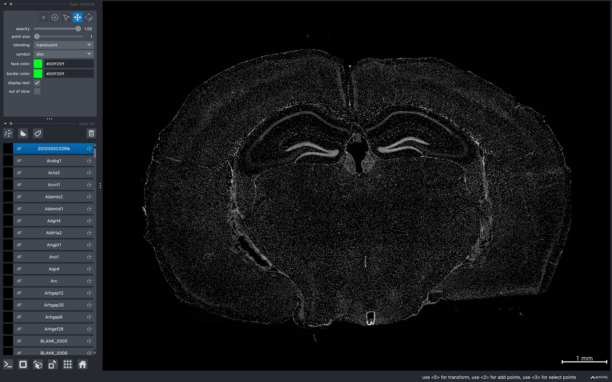
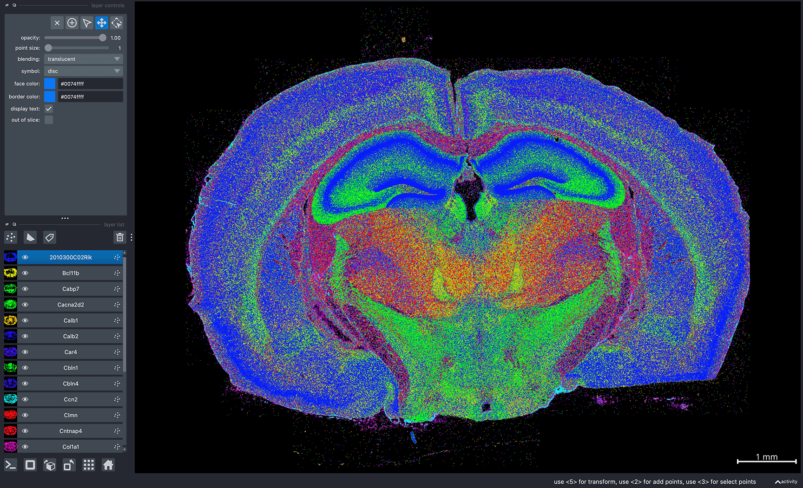
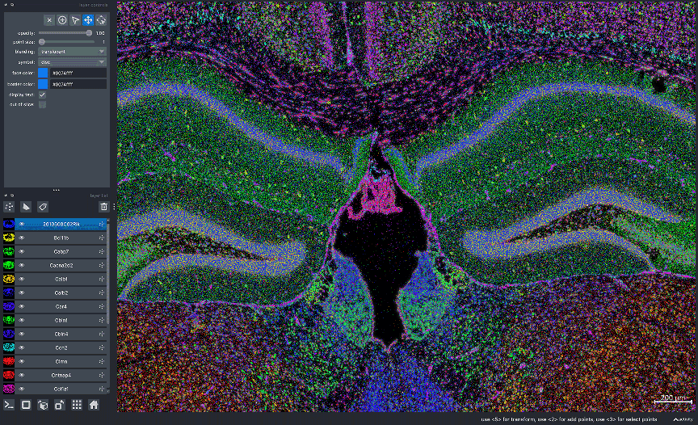

```{toctree}
:hidden: true
```
# {octicon}`rocket` Getting Started

To visualize data in Bella Vista, you need a JSON configuration file containing dataset-specific parameters.

## Configuration JSON file structure

```{eval-rst}
.. code-block:: JSON

  {
    "system": "spatial_technology",
    "data_folder": "/path/to/dataset",
    "create_bellavista_inputs": true,
    
    "visualization_parameters": {
        "plot_image": true,
        "plot_transcripts": true,
        "plot_cell_seg": true
    },
  
    "input_files": {
        "transcript_filename": "transcript_filename",
        "images": "image_filename.tif",
        "cell_segmentation": "cell_seg_filename"
    }
  } 
```

## General parameters

**system**: *string*
: Allowed values: `"Xenium"`, `"MERSCOPE"`, or `"MERlin"`. Specifies the spatial transcriptomic technology. The input is not case-sensitive, so values "xenium", "Xenium", and "XENIUM" are treated equivalently

**data_folder**: *string*
: The path to the folder where the dataset output files are stored. Bella Vista visualization files will be saved in a new folder named `BellaVista_output` within the data_folder.
  
**create_bellavista_inputs**: *boolean, default=true*
: Specifies whether to generate the necessary visualization files for Bella Vista. It should be set to `true` when loading the data for the first time. It can be set to `false` in later runs, as the files will already have been created.

  > If set to `true` and the visualization files already exist from a previous run, Bella Vista will skip recreating those files and only generate any missing ones.

## Visualization parameters

**plot_image**: *boolean, default=false*
: Display image(s)

**plot_transcripts**: *boolean, default=false*
: Plot spatial coordinates of gene transcripts

**plot_allgenes**: *boolean, default=true*
: Plot transcripts for all gene IDs. If set to `false`, only the gene IDs specified in `selected_genes` will be plotted

**genes_visible_on_startup**: *boolean, default=false*
: Controls the visibility of all gene layers at startup. If set to `false`, the gene layers will be hidden
> Setting this option to false improves navigation performance. Gene layers can be shown later using the toggle visibility feature.

**selected_genes**: *1D array of strings, default=None*
:  Specifies the gene IDs whose transcripts will be plotted. If None, transcripts for all genes will be plotted

**plot_cell_seg**: *boolean, default=false*
: Plot cell segmentation

**plot_nuclear_seg**: *boolean, default=false*
: Plot nuclear segmentation

**transcript_point_size**: *float, default=1*
: Size of the points representing individual transcript coordinates

**contrast_limits**: *tuple array of integers, default=None*
: Range of values [0, 65535] used to set the contrast limits for the displayed image(s)

**rotate_angle**: *integer, default=0*
: Rotation angle in degrees, within the range [0, 360], by which to rotate the data

## Input file parameters

Each technoloy has technology-specific input file requirements. Technology-specific input file parameters and example JSON files can be found in the tutorials below:

::::{grid} 2

:::{grid-item-card}  10x Genomics Xenium
:width: auto
:link: bellavista_tutorials/10x_xenium.html

Step-by-step guide to visualizing Xenium datasets
:::

:::{grid-item-card}  Vizgen MERSCOPE
:width: auto
:link: bellavista_tutorials/vizgen_merscope.html

Step-by-step guide to visualizing MERSCOPE datasets
:::

:::{grid-item-card}  MERFISH - MERlin
:width: auto
:link: bellavista_tutorials/merfish_merlin.html

Step-by-step guide to visualizing MERFISH datasets processed via the MERlin pipeline
:::
::::


## Loading Bella Vista

Once your JSON is correctly configured for your dataset, you can run Bella Vista in the terminal:

  - Replace `my_dataset.json` with the filename of the JSON you created. The JSON file argument should contain the file path to your JSON file.
```{eval-rst}
.. code-block:: console

  $ bellavista my_dataset.json
```
```{eval-rst}
.. note::

    It will take a few minutes to create the required data files. The terminal will print updates & have progress bars for time consuming steps.
```

Once loaded, you should see a napari window displaying your data. Now, you can interactively move around the napari canvas to explore the data. Try zooming in & out, toggling layers on & off to see different spatial patterns! 

```{eval-rst}
.. tip::

    To visualize a single layer, and hide all other layers, :samp:`Option/Alt-click` on the visibility button (the eye, to the left of the layer name). Check out :ref:`helpful-napari-tips` in the FAQ for more tips!
```

Refer to the tutorial below for a step-by-step guide on running Bella Vista with a sample dataset and JSON.

If you encounter any issues, please check the [FAQ](../faq.md#frequently-asked-questions). If you're experiencing issues not addressed in the FAQ, please check the open issues or [open a new issue](https://github.com/pkosurilab/BellaVista/issues)in our GitHub repository. You can also leave any feedback here!

<br>

## Getting Started (with sample data)

Below is a short tutorial for loading Bella Vista with sample Xenium data. This tutorial can also be found in the [Xenium tutorial page](bellavista_tutorials/10x_xenium)

### Download sample data

1. Download sample data from Zenodo: Xenium mouse brain dataset (Replicate 3) [https://zenodo.org/records/14279832](https://zenodo.org/records/14279832)


  
### Load Bella Vista

2. Run BellaVista from the command line with the Xenium sample data:

    - Replace `/path/to/` with the actual path to the Xenium sample data folder.

```{eval-rst}
.. code-block:: console

  $ bellavista --xenium-sample /path/to/xenium_mouse_brain_rep3
```

```{eval-rst}
.. note::

    It will take a few minutes to create the required data files. The terminal will print updates & have progress bars for time consuming steps.
```

Once successfully loaded, you should see the message `Data Loaded!` in the terminal.\
A napari window should appear displaying the data similar to the image below:



```{eval-rst}
.. admonition:: This is a large dataset, so if the program encounters a memory-related error, try visualizing a smaller subset of the data with the command:
    
    .. code-block:: console

        $ bellavista --xenium-sample-lite /path/to/xenium_mouse_brain_rep3

    

    For more information, see `What should I do if the program crashes? <faq.html#reducing-memory-requirements>`_ in the FAQ.
```

Now, you can interactively move around the napari canvas to explore the data!\
Try zooming in & out, toggling layers on & off to see different spatial patterns:

<div style="position: relative; width: 100%; display: flex; justify-content: space-between; align-items: flex-end;">
  
  
</div>

```{eval-rst}
.. tip::

    To visualize a single layer, and hide all other layers, :samp:`Option/Alt-click` on the visibility button (the eye, to the left of the layer name). Check out :ref:`helpful-napari-tips` in the FAQ for more tips!
```

```{eval-rst}
.. note::

    Gene colors are assigned randomly every time Bella Vista is launched. So, the gene colors displayed in your window will be different from the image above. See :ref:`helpful-napari-tips` in the FAQ for information on how to configure gene colors and other customizable visualization options. 
    
    To reproduce the same colors every time you launch Bella Vista, see :ref:`creating-figures` in the Figure Guide.
```

For an exact reproduction of the two screenshots above, please refer to the figure guide: [Reproducing sample figures (Xenium)](./figure_guide.md#Reproducing-sample-figures-(Xenium))


<div class="flex justify-between items-center pt-6 mt-12 border-t border-border gap-4">
    <div class="mr-auto">
      <a href="installation.html" class="inline-flex items-center justify-center rounded-md text-sm font-medium transition-colors border border-input hover:bg-accent hover:text-accent-foreground py-2 px-4" style="text-decoration: none;">
        <svg xmlns="http://www.w3.org/2000/svg" width="24" height="24" viewBox="0 0 24 24" fill="none" stroke="currentColor" stroke-width="2" stroke-linecap="round" stroke-linejoin="round" class="mr-2 h-4 w-4">
          <polyline points="15 18 9 12 15 6"></polyline>
        </svg>
        Installation
      </a>
    </div>
  <div class="ml-auto">
    <a href="tutorials.html" class="inline-flex items-center justify-center rounded-md text-sm font-medium transition-colors border border-input hover:bg-accent hover:text-accent-foreground py-2 px-4" style="text-decoration: none;">
      Tutorials
      <svg xmlns="http://www.w3.org/2000/svg" width="24" height="24" viewBox="0 0 24 24" fill="none" stroke="currentColor" stroke-width="2" stroke-linecap="round" stroke-linejoin="round" class="ml-2 h-4 w-4">
        <polyline points="9 18 15 12 9 6"></polyline>
      </svg>
    </a>
  </div>
</div>
