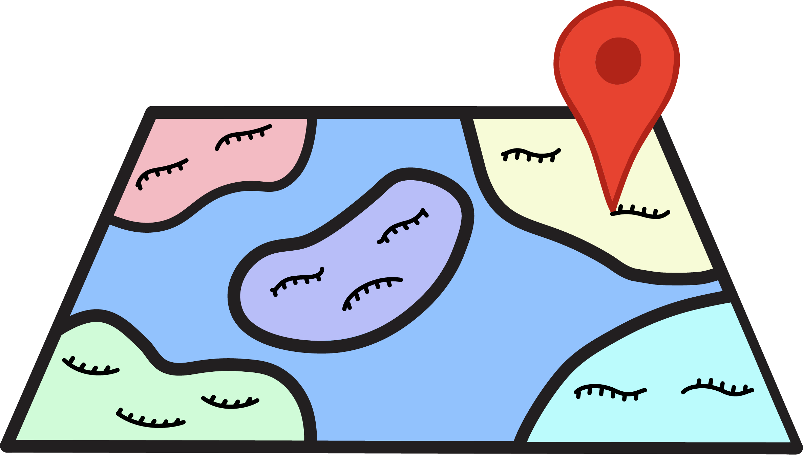
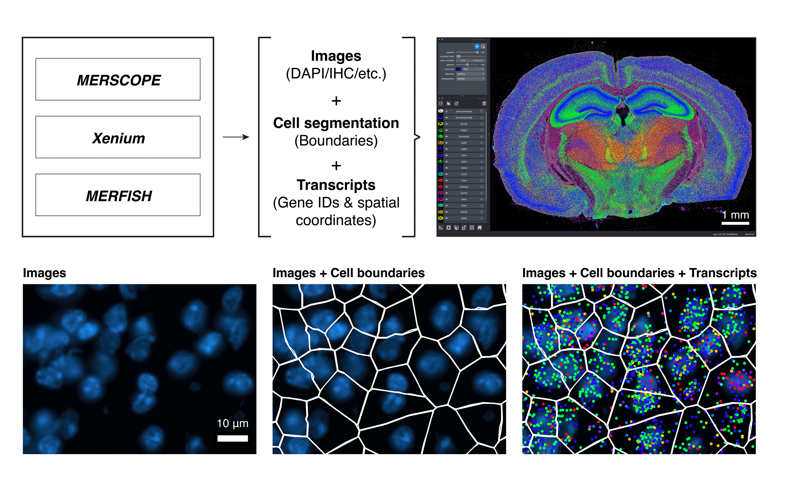

```{toctree}
:hidden: true

installation
get_started
tutorials
figure_guide
faq
api
```


#

 

<h1 style="margin-top: -1em">Bella Vista</h1>
<h2  style="margin-top: 0.5em; margin-bottom: 0.8em">Open-Source Visualization for Imaging-Based Spatial Transcriptomics </h2>

 

Bella Vista is an open-source Python package developed for 10x Genomics Xenium, Vizgen MERSCOPE, and custom (home-built) MERFISH datasets utilizing [napari](https://napari.org/) for interactive data exploration. We developed Bella Vista to help the spatial transcriptomics community explore their data and create reproducible paper-ready figures.
<br/><br/>
If you find this tool useful in your research, please cite our [GitHub repository](https://github.com/pkosurilab/BellaVista)


::::{grid} 2
:::{grid-item-card} {octicon}`terminal` Installation
:link: installation.html
:::

:::{grid-item-card} {octicon}`rocket` Get Started
:link: get_started.html
:::

:::{grid-item-card} {octicon}`workflow` Tutorials
:link: tutorials.html
:::

:::{grid-item-card} {octicon}`pencil` Figure Guide
:link: figure_guide.html
:::

:::{grid-item-card} {octicon}`question` FAQ
:link: faq.html
:::

:::{grid-item-card} {octicon}`code-square` API
:link: api.html
:::
::::

<div class="flex justify-between items-center pt-6 mt-12 border-t border-border gap-4">
  <div class="ml-auto">
    <a href="installation.html" class="inline-flex items-center justify-center rounded-md text-sm font-medium transition-colors border border-input hover:bg-accent hover:text-accent-foreground py-2 px-4" style="text-decoration: none;">
      Installation
      <svg xmlns="http://www.w3.org/2000/svg" width="24" height="24" viewBox="0 0 24 24" fill="none" stroke="currentColor" stroke-width="2" stroke-linecap="round" stroke-linejoin="round" class="ml-2 h-4 w-4">
        <polyline points="9 18 15 12 9 6"></polyline>
      </svg>
    </a>
  </div>
</div>
